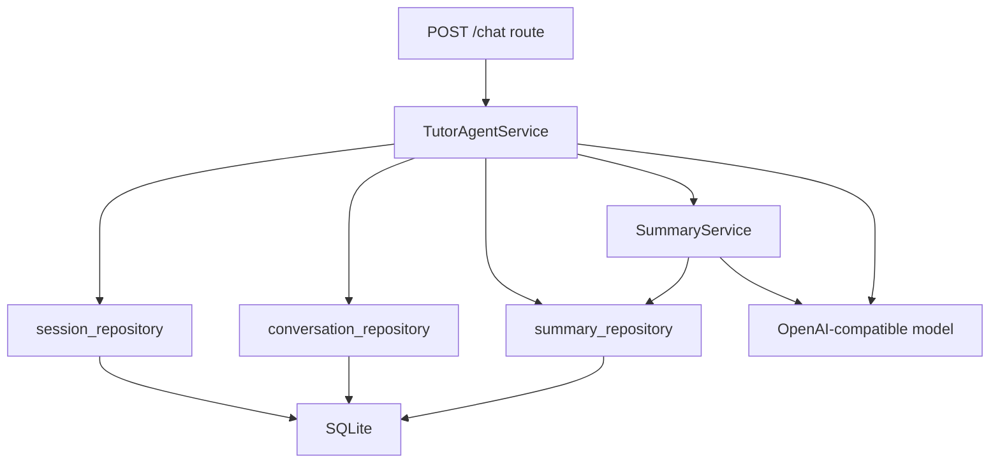
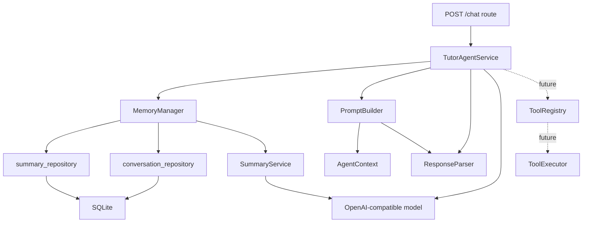

# Tutor Agent Core 架构设计

## 1. 文档目标

这份文档是 Tutor Agent 的第一版 Agent Core 重构蓝图。

当前项目已经具备：

- `/chat` 聊天接口
- `chat_sessions` 多会话隔离
- `conversations` 对话历史保存
- `session_summaries` 会话滚动摘要
- `SummaryService` 摘要生成与更新
- React 前端聊天界面

下一步的重点不是马上做新功能，而是先把后端 Agent 主流程拆清楚，避免所有能力继续堆进 `TutorAgentService`。

第一轮重构采用保守拆分：

```text
app/services/agent/
  __init__.py
  context.py
  memory_manager.py
  prompt_builder.py
  response_parser.py
```

目标是让 `TutorAgentService` 从“什么都做的服务”变成“负责串流程的用例入口”。

## 2. 非目标

第一轮不做这些事：

- 不改变 `/chat` 请求和响应格式
- 不改变前端
- 不新增工具调用功能
- 不设计具体工具 schema
- 不新增 RAG
- 不新增长期记忆表
- 不重写数据库层
- 不把项目改成复杂的 Clean Architecture 或 DDD 分层

工具调用会在架构图里预留位置，但第一轮不会实现。

## 3. 当前结构

现在的主流程基本集中在 `TutorAgentService`：



`TutorAgentService` 当前承担了这些职责：

- 解析 `session_id`
- 读取最近历史
- 读取会话摘要
- 拼模型 `messages`
- 调用模型
- 解析模型回复
- 解析历史回复里的 `answer`
- 保存本轮对话
- 触发摘要更新
- 兜底摘要更新失败
- 组装 `ChatResponse`

这些职责都和聊天有关，但放在一个类里会越来越重。后续如果继续加工具调用、长期记忆、RAG，`TutorAgentService` 会变得难读、难测、难改。

## 4. 目标结构

第一轮目标结构：



第一轮拆分后：

- `TutorAgentService` 仍然是 `/chat` 的入口服务
- `TutorAgentService` 继续负责 session 解析、流程编排、模型调用、响应组装
- `MemoryManager` 负责会话记忆的读取与写入
- `PromptBuilder` 负责把 `AgentContext` 转成模型 `messages`
- `ResponseParser` 负责解析模型回复和历史回复

未来工具调用可以接在 `TutorAgentService` 的编排流程里，但当前只预留位置。

## 5. AgentContext

`AgentContext` 是 Agent Core 内部使用的上下文对象。

位置：

```text
app/services/agent/context.py
```

第一版草案：

```python
from dataclasses import dataclass

from app.db.models import ConversationRecord


@dataclass
class AgentContext:
    user_id: str
    session_id: int
    current_message: str
    summary_text: str | None
    recent_history: list[ConversationRecord]
```

它表示一次 `/chat` 调用进入模型之前，Agent 已经准备好的上下文。

第一版只包含：

- 当前用户
- 当前会话
- 本轮用户问题
- 会话摘要
- 最近历史

未来可以扩展：

```python
@dataclass
class AgentContext:
    user_id: str
    session_id: int
    current_message: str
    summary_text: str | None
    recent_history: list[ConversationRecord]
    tool_results: list[ToolResult]
    retrieved_docs: list[RetrievedDocument]
    user_profile: UserProfile | None
```

但第一轮不要提前实现这些未来字段。

## 6. MemoryManager

位置：

```text
app/services/agent/memory_manager.py
```

职责：

- 读取当前会话的 `summary_text`
- 读取当前会话最近 `RECENT_HISTORY_LIMIT` 条历史
- 创建 `AgentContext`
- 保存本轮对话
- 触发 `SummaryService.update_summary_if_needed(session_id)`
- 摘要更新失败时不影响聊天主流程

不负责：

- 不解析 session 是否存在
- 不拼 prompt
- 不调用聊天模型
- 不解析模型回复
- 不处理 HTTP 错误

轻量接口草案：

```python
class MemoryManager:
    def __init__(self, summary_service: SummaryService) -> None:
        self.summary_service = summary_service

    def load_context(
        self,
        user_id: str,
        session_id: int,
        current_message: str,
    ) -> AgentContext:
        ...

    def save_turn_and_update_summary(
        self,
        user_id: str,
        session_id: int,
        message: str,
        reply: TutorReply,
    ) -> None:
        ...
```

`load_context(...)` 内部会做：

```text
get_summary(session_id)
list_recent_conversations(user_id, session_id, RECENT_HISTORY_LIMIT)
return AgentContext(...)
```

`save_turn_and_update_summary(...)` 内部会做：

```text
reply -> JSON string
save_conversation(...)
try SummaryService.update_summary_if_needed(session_id)
except Exception: pass
```

这里把摘要更新失败吞掉，是为了保持当前行为：摘要是辅助记忆能力，失败时不影响本轮聊天返回。

## 7. PromptBuilder

位置：

```text
app/services/agent/prompt_builder.py
```

职责：

- 接收 `AgentContext`
- 构建模型需要的 `messages`
- 保证消息顺序正确
- 使用 `ResponseParser.parse_history_answer(...)` 从历史 `reply_json` 里提取导师回答

不负责：

- 不查数据库
- 不保存对话
- 不调用模型
- 不解析当前模型回复
- 不更新摘要

轻量接口草案：

```python
class PromptBuilder:
    def __init__(self, response_parser: ResponseParser) -> None:
        self.response_parser = response_parser

    def build_messages(
        self,
        context: AgentContext,
    ) -> list[ChatCompletionMessageParam]:
        ...
```

第一版 `messages` 顺序：

```text
system: 固定导师规则和 JSON 输出要求
system: 较早历史摘要，可选
user/assistant: 最近历史，按旧到新
user: 当前问题
```

也就是：

```text
system
+ summary
+ recent_history
+ current_message
```

如果没有 `summary_text`，就不添加摘要消息。

## 8. ResponseParser

位置：

```text
app/services/agent/response_parser.py
```

职责：

- 解析当前模型原始回复为 `TutorReply`
- 清理模型可能返回的 Markdown JSON 代码块
- 模型返回非 JSON 时生成 fallback `TutorReply`
- 从历史 `reply_json` 中提取 `answer`

不负责：

- 不调用模型
- 不保存数据库
- 不拼 prompt
- 不处理 HTTP 错误

轻量接口草案：

```python
class ResponseParser:
    def parse_model_reply(self, raw_reply: str) -> TutorReply:
        ...

    def parse_history_answer(self, reply_json: str) -> str | None:
        ...
```

迁移来源：

- `TutorAgentService._parse_model_reply(...)`
- `TutorAgentService._parse_history_answer(...)`

迁移后，`TutorAgentService` 不再关心 JSON 解析细节。

## 9. TutorAgentService

`TutorAgentService` 第一轮继续作为 `/chat` 的用例入口。

保留职责：

- 根据 `user_id + session_id` 解析当前会话
- 编排一次聊天流程
- 调用模型
- 组装 `ChatResponse`

迁出职责：

- 记忆读取迁到 `MemoryManager`
- prompt 构建迁到 `PromptBuilder`
- 当前回复解析迁到 `ResponseParser`
- 历史 answer 解析迁到 `ResponseParser`
- 对话保存和摘要更新迁到 `MemoryManager`

目标编排形态：

```python
class TutorAgentService:
    def chat(self, request: ChatRequest) -> ChatResponse:
        user_id = request.user_id
        message = request.message
        session = self._resolve_session(user_id, request.session_id)

        context = self.memory_manager.load_context(
            user_id=user_id,
            session_id=session.id,
            current_message=message,
        )

        if not context.recent_history and session.title == DEFAULT_SESSION_TITLE:
            update_session_title(session.id, make_title_from_message(message))

        messages = self.prompt_builder.build_messages(context)
        raw_reply = self._call_model(messages)
        reply = self.response_parser.parse_model_reply(raw_reply)

        self.memory_manager.save_turn_and_update_summary(
            user_id=user_id,
            session_id=session.id,
            message=message,
            reply=reply,
        )

        return ChatResponse(
            user_id=user_id,
            session_id=session.id,
            message=message,
            reply=reply,
        )
```

这不是要一次复制粘贴的最终代码，而是重构目标。

## 10. 未来工具调用位置

第一轮不实现工具调用，但架构要预留位置。

未来可以放在这个流程里：

```text
PromptBuilder.build_messages(context)
  -> call model
  -> ResponseParser.parse_model_reply(raw_reply)
  -> 如果模型返回 tool intent
  -> ToolRegistry 找工具
  -> ToolExecutor 执行工具
  -> 工具结果进入下一轮 messages 或最终响应
```

未来可能新增：

```text
app/services/agent/
  tool_registry.py
  tool_executor.py
  tool_result_formatter.py
```

但当前文档不设计具体工具，不设计工具 schema，也不实现 `create_learning_task` 等工具。

## 11. 第一轮重构 checklist

按这个顺序做：

1. 新建 `app/services/agent/__init__.py`
2. 新建 `app/services/agent/context.py`
3. 在 `context.py` 中定义 `AgentContext`
4. 新建 `app/services/agent/response_parser.py`
5. 把 `TutorAgentService._parse_model_reply(...)` 迁到 `ResponseParser.parse_model_reply(...)`
6. 把 `TutorAgentService._parse_history_answer(...)` 迁到 `ResponseParser.parse_history_answer(...)`
7. 新建 `app/services/agent/prompt_builder.py`
8. 把 `TutorAgentService._build_messages(...)` 迁到 `PromptBuilder.build_messages(context)`
9. 让 `PromptBuilder` 使用 `ResponseParser.parse_history_answer(...)`
10. 新建 `app/services/agent/memory_manager.py`
11. 把读取 summary 和 recent history 的逻辑迁到 `MemoryManager.load_context(...)`
12. 把保存 conversation 和触发 summary update 的逻辑迁到 `MemoryManager.save_turn_and_update_summary(...)`
13. 修改 `TutorAgentService.__init__`，注入 `MemoryManager`、`PromptBuilder`、`ResponseParser`
14. 修改 `TutorAgentService.chat()`，只保留 session 解析、流程编排、模型调用、响应组装
15. 保持 `/chat` 请求和响应格式不变
16. 跑现有测试
17. 补模块单元测试
18. 再跑全量测试

每一步都应该小改小测，不要一次性大搬家。

## 12. 测试策略

第一轮重构是内部结构变化，外部行为必须保持不变。

继续保留现有 API 测试：

- `/chat` 返回结构化回复
- `/chat` 保存对话
- `/chat` 使用当前 session 的历史
- `/chat` 不混入其他 session 的历史
- `/chat` 带上 summary
- `/chat` 保存后触发 summary update
- summary update 失败时 `/chat` 仍然正常返回

新增模块单元测试：

### MemoryManager 测试

覆盖：

- `load_context(...)` 能读到 summary
- `load_context(...)` 能读到最近历史
- `save_turn_and_update_summary(...)` 会保存本轮对话
- `save_turn_and_update_summary(...)` 会触发摘要更新
- 摘要更新失败时不抛出到聊天主流程

### PromptBuilder 测试

覆盖：

- 没有 summary 时，只构建 system + history + current message
- 有 summary 时，summary 出现在最近历史之前
- 历史按旧到新进入 prompt
- 当前问题永远在最后
- 历史 `reply_json` 损坏时，不让 prompt 构建失败

### ResponseParser 测试

覆盖：

- 合法 JSON 可以解析成 `TutorReply`
- Markdown ```json 代码块可以清理后解析
- 非 JSON 回复会进入 fallback
- 空回复会报错
- 历史 `reply_json` 能提取 `answer`
- 历史 `reply_json` 损坏时返回 `None`

## 13. 验收标准

第一轮重构完成后，应满足：

- `/chat` API 行为和现在一致
- 所有现有测试通过
- 新增模块测试通过
- `TutorAgentService` 明显变瘦
- prompt 构建逻辑集中在 `PromptBuilder`
- 回复解析逻辑集中在 `ResponseParser`
- 会话记忆读写集中在 `MemoryManager`
- 工具调用仍然没有实现，但架构图里已经有未来位置

## 14. 学习重点

完成这轮重构后，应该能解释清楚：

- 为什么 route 不应该写业务逻辑
- 为什么 `TutorAgentService` 不应该无限膨胀
- 为什么 prompt 构建需要独立出来
- 为什么模型回复解析需要独立出来
- 为什么记忆读写应该有清楚边界
- 为什么第一轮不做工具调用
- 为什么工业界常常先在当前结构里渐进式拆分，而不是一开始就上重架构

这一轮重构的目的不是炫技，而是让后面的工具调用、长期记忆、RAG 都有地方生长。
