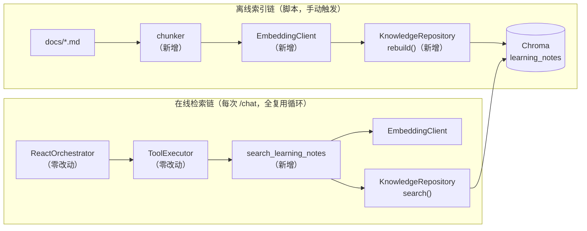

# Tutor Agent 设计文档 — v0.3 RAG「能用」

| 项 | 内容 |
|---|---|
| 类型 | 技术设计文档（How），对应 PRD v0.3 的 FR3.1–FR3.11 |
| 日期 | 2026-07-05 |
| 代码基线 | `Chuwhyangle/Totur-Agent` @ commit `9276719` |
| 建议归档路径 | `docs/superpowers/specs/2026-07-05-rag-v03-design.md` |
| 硬约束 | `react_orchestrator.py` / `executor.py` / `tutor_agent_service.py` 零改动（PRD AC4） |

---

## 1. 设计总览

RAG 在本项目中 = **第三个工具 + 一条离线索引链**。所有 Agent 侧机制（循环、截断、错误回传、trace）复用 v0.2，不新增任何循环逻辑。



## 2. 文件布局

| 文件 | 动作 | 内容 | 对应 FR |
|---|---|---|---|
| `app/services/knowledge_chunker.py` | 新增 | markdown 分块器（纯函数，无 IO） | FR3.1 |
| `app/clients/embedding_client.py` | 新增 | OpenAI-compatible embedding 客户端 | FR3.2 |
| `app/config.py` | 修改 | 追加 `EmbeddingConfig` + `load_embedding_config()` | FR3.2 |
| `app/repositories/knowledge_repository.py` | 新增 | Chroma 访问层（rebuild/search/count） | FR3.3 |
| `scripts/build_knowledge_index.py` | 新增 | 全量重建索引脚本 | FR3.4 |
| `app/services/rag_settings.py` | 新增 | RAG 参数集中配置（仿 `memory_settings.py`） | FR3.8 |
| `app/services/agent/tools/search_learning_notes.py` | 新增 | 检索工具函数 | FR3.5/3.7 |
| `app/services/agent/tools/registry.py` | 修改 | schema 常量 + 注册（仅两处 diff） | FR3.6 |
| `app/services/agent/personas.py` | 修改 | 新增共享 `KNOWLEDGE_TOOL_PROMPT`，进 `build_system_prompt` 拼装 | FR3.9 |
| `tests/test_knowledge_chunker.py`、`tests/test_knowledge_search.py` | 新增 | 测试 | FR3.10 |
| `requirements.txt` / `.env.example` / `.gitignore` / `README.md` | 修改 | `chromadb` 依赖、`EMBEDDING_MODEL`、忽略 `chroma_db/`、文档 | FR3.11 |

## 3. 模块设计

### 3.1 分块器 `knowledge_chunker.py`

```python
@dataclass(frozen=True)
class KnowledgeChunk:
    content: str        # 块正文（含所属标题行，增强 embedding 语义）
    source: str         # 相对路径，如 docs/agent-architecture.md
    title_path: str     # 标题链，如 "Agent 架构设计 > 非目标"
    chunk_index: int    # 同一文件内序号，从 0 开始

def chunk_markdown(text: str, source: str) -> list[KnowledgeChunk]: ...
```

切分算法（纯函数，两级策略）：
1. 按标题行（`#`–`###`）把文档切成章节，维护标题栈生成 `title_path`
2. 章节正文 ≤ `CHUNK_SIZE`（512 字符）→ 整段成块；超长 → 按 512 字符滑窗、`CHUNK_OVERLAP=50` 重叠切分
3. 忽略空章节；代码块视为普通文本不特殊处理（v0.3 简化，记入开放点）

块 ID 规则：`{source}#{chunk_index}`——确定性 ID 保证重跑幂等。

### 3.2 Embedding 客户端 `embedding_client.py` + `config.py`

`config.py` 追加（完全仿照现有 `LLMConfig` 的写法）：

```python
@dataclass
class EmbeddingConfig:
    api_key: str      # 复用 OPENAI_API_KEY
    base_url: str     # 复用 OPENAI_BASE_URL
    model: str        # 新环境变量 EMBEDDING_MODEL

def load_embedding_config() -> EmbeddingConfig: ...  # 缺 EMBEDDING_MODEL 时 RuntimeError
```

客户端接口（一次批量调用，索引脚本按 batch=32 分批）：

```python
class EmbeddingClient:
    def __init__(self, config: EmbeddingConfig | None = None) -> None: ...
    def embed_texts(self, texts: list[str]) -> list[list[float]]: ...
    # SDK 异常统一包装为 EmbeddingError，由调用方决定错误码
```

### 3.3 Chroma 访问层 `knowledge_repository.py`

```python
class KnowledgeRepository:
    def __init__(self, client: chromadb.ClientAPI | None = None) -> None:
        # 默认 PersistentClient(path=CHROMA_PERSIST_DIR)；测试注入 EphemeralClient
    def rebuild(self, chunks: list[KnowledgeChunk], embeddings: list[list[float]]) -> int: ...
    def search(self, query_embedding: list[float], top_k: int) -> list[KnowledgeHit]: ...
    def count(self) -> int: ...   # 集合不存在时返回 0

@dataclass(frozen=True)
class KnowledgeHit:
    content: str
    source: str
    title_path: str
    similarity: float   # = 1 - cosine_distance，统一在此换算
```

关键点：
- 集合 `learning_notes` 创建参数 `metadata={"hnsw:space": "cosine"}`——不配这个 Chroma 默认 L2，阈值就没意义
- `rebuild` = `delete_collection`（容忍不存在）→ `create_collection` → 分批 `add(ids, documents, embeddings, metadatas)`
- metadata 只存 `source` / `title_path` / `created_at`（Chroma metadata 值须为标量）
- 相似度换算收敛在 repository，工具层只见 `similarity`，未来换 Milvus 只改这一层（PRD FR5.4 伏笔）

### 3.4 检索工具 `search_learning_notes.py`

```python
def search_learning_notes(query: str, limit: int | None = None) -> dict[str, Any]: ...
```

执行顺序与错误契约（全部走 v0.2 的 `ok:false` 观察回传，循环自动兜底）：

| 顺序 | 检查/动作 | 失败返回 |
|---|---|---|
| 1 | `query` 非空白 | `{"ok": False, "error": "invalid_arguments", "message": ...}` |
| 2 | `repository.count() == 0` | `{"ok": False, "error": "index_not_built", "message": "请先运行 scripts/build_knowledge_index.py"}` |
| 3 | `embed_texts([query])` | `{"ok": False, "error": "embedding_failed", "message": ...}` |
| 4 | `search(top_k=RAG_TOP_K)` + 阈值过滤 | 无达标结果 → `{"ok": True, "found": False, "results": [], "message": "未找到相关笔记"}` |

成功返回（**每条结果带 `title` 字段 = `title_path`，直接复用 `react_orchestrator` 现有 trace 预览的 `top_titles` 提取逻辑，这是零改动循环的关键细节**）：

```json
{
  "ok": true, "found": true, "count": 2,
  "results": [
    {"title": "记忆与多轮方案 > 滚动摘要", "content": "...", 
     "source": "docs/memory-and-multi-turn-plan.md", "similarity": 0.62}
  ]
}
```

依赖获取：模块级懒加载单例 `_get_repository()` / `_get_embedding_client()`，测试用 monkeypatch 替换（与现有工具测试同套路）。

### 3.5 注册 `registry.py`（仅两处 diff）

新增 `SEARCH_LEARNING_NOTES_SCHEMA` 常量（description 强调"检索用户自己的学习笔记"；参数 `query` 必填 + `limit` 可选 1–5 默认 3，结构抄 `INTERVIEW_JD_SEARCH_SCHEMA`），然后 `__init__` 的 dict 与 `get_tools_schema` 列表各加一行。

### 3.6 提示词 `personas.py`

新增共享块（所有人设生效，不进任何单个人设的 prompt——笔记检索与人设无关）：

```python
KNOWLEDGE_TOOL_PROMPT = (
    "当用户问到自己的笔记、之前记过/讨论过/复盘过的内容时，"
    "调用 search_learning_notes 检索学习笔记后再回答。\n"
    "引用笔记内容时必须在句末标注出处，格式：（来源：文件名）。\n"
    "工具返回 found=false 或 index_not_built 时，如实告知没有找到相关笔记，"
    "再基于你自己的知识回答，不得伪造出处。"
)
```

`build_system_prompt` 拼装顺序改为：`persona.system_prompt` + `KNOWLEDGE_TOOL_PROMPT` + `STRUCTURED_REPLY_PROMPT`（输出契约永远压轴）。

### 3.7 索引脚本 `build_knowledge_index.py`

```text
流程：load_embedding_config（快速失败）→ 扫描 docs/**/*.md（按文件名排序，保证确定性）
     → 逐文件 chunk_markdown → 汇总后分批 embed_texts → repository.rebuild
输出：每文件一行「source: N chunks」+ 末行汇总「files=X chunks=Y collection=learning_notes」
退出码：成功 0；配置缺失/embedding 失败非 0（方便以后接 CI）
```

## 4. 配置与依赖清单

`app/services/rag_settings.py`（注释风格仿 `memory_settings.py`）：

| 常量 | 初值 | 说明 |
|---|---|---|
| `CHUNK_SIZE` | 512 | 对齐 DeepTutor 默认，v0.4 评测校准 |
| `CHUNK_OVERLAP` | 50 | 滑窗兜底切分的重叠 |
| `RAG_TOP_K` | 3 | 检索返回条数上限 |
| `SIMILARITY_THRESHOLD` | 0.35 | 低于即丢弃；v0.4 评测校准（PRD OQ1） |
| `KNOWLEDGE_COLLECTION_NAME` | "learning_notes" | Chroma 集合名 |
| `CHROMA_PERSIST_DIR` | "chroma_db" | 项目根目录下持久化路径 |
| `KNOWLEDGE_SOURCE_DIR` | "docs" | 索引语料目录 |
| `EMBEDDING_BATCH_SIZE` | 32 | 索引脚本分批大小 |

其他：`requirements.txt` + `chromadb`；`.env.example` + `EMBEDDING_MODEL=`；`.gitignore` + `chroma_db/`。

## 5. 测试设计（映射 PRD AC）

| 测试文件 | 用例 | 覆盖 |
|---|---|---|
| `test_knowledge_chunker.py` | 标题层级→title_path 正确；短章节整段成块；超长章节滑窗+重叠；空文件/无标题文件；块 ID 确定性（同输入两次结果一致） | AC1 的分块部分 |
| `test_knowledge_search.py` | FakeEmbeddingClient（返回手工设计的正交/近似向量，排序可精确断言）+ `EphemeralClient` 注入：top-k 排序正确、阈值过滤生效、found=false 路径、空 query→invalid_arguments、空集合→index_not_built、embedding 异常→embedding_failed、成功结果含 title/source/similarity | AC2 |
| 手动端到端 | 建真实索引 → `/chat` 问"我笔记里关于记忆分层的方案"→ 回答含（来源：…） | AC3 |
| 回归 | `pytest -q` 全绿 + `git diff --stat` 确认 `react_orchestrator.py` 等三文件零改动 | AC4 |

FakeEmbeddingClient 设计要点：维护 `text → vector` 字典，未知文本返回全零向量——排序断言不依赖任何真实模型。

## 6. 三天排期

| 天 | 交付 | 文件 |
|---|---|---|
| D1 | 分块器 + 配置 + embedding 客户端 + 索引脚本跑通真实建库 | chunker、rag_settings、config、embedding_client、脚本 + chunker 测试 |
| D2 | Chroma repository + 工具 + 注册，mock 测试全绿 | knowledge_repository、search_learning_notes、registry + search 测试 |
| D3 | 提示词接入 + 端到端验证 + 文档复盘 | personas、README、agent-architecture.md、.env.example |

## 7. 开放实现点（动手时再定，不阻塞开工）

- **OP1** 代码块切分：v0.3 当普通文本；若代码被腰斩影响检索，v0.4 分块调优时处理
- **OP2** `title_path` 分隔符暂定 `" > "`；中文标题含 `>` 的极端情况忽略
- **OP3** Chroma 版本锁定：动手当天确认 `chromadb` 最新稳定版并在 requirements.txt 固定版本号（R6 缓解）
- **OP4** `limit` 参数上限钳制到 5（防模型传大数撑爆观察，虽然截断兜底也在）